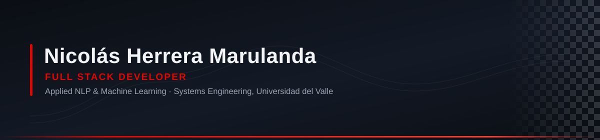

  

  
  
  

  

---

## About

Systems Engineering student finishing my degree at **Universidad del Valle** (Cali, Colombia), with professional experience since 2023 across frontend, backend, and applied NLP.

My undergraduate thesis builds a named entity recognition system for Spanish clinical text, comparing CRF, BiLSTM, RoBERTa and LLM approaches. In 2026 I completed a research internship at the **PReCISE group, Université de Namur** (Belgium) — where, fittingly for the theme of this page, I modeled the variability of the **FIA Formula 1 2026 Technical Regulations** using formal methods and SMT solvers.

## Telemetry

  
  
  
  
  

## Stack

**Languages &amp; frameworks**

**Data &amp; machine learning**

**Infrastructure &amp; tooling**

## Featured work

<table>
<tr>
<td width="50%" valign="top">

### 🏁 [MedAI](https://github.com/Herreran903/medai-backend)
**Undergraduate thesis** · Clinical NER in Spanish

Corpus annotated from scratch, four modeling approaches compared, **0.8767 strict F1** validated against an expert-annotated set. Served through a FastAPI microservices backend exposing five selectable models, each isolated in its own container.

   

</td>
<td width="50%" valign="top">

### 🧠 [NER model pipelines](https://github.com/Herreran903/ner_pipelines)
Neural architectures behind the thesis

Training pipelines for **BiLSTM+CRF** and transformer models: embedding utilities, data preprocessing, model wrappers and evaluation notebooks. Hyperparameter search with Optuna.

  

</td>
</tr>
<tr>
<td width="50%" valign="top">

### ⚙️ [Emazon microservices](https://github.com/Herreran903/api-stock)
**Pragma Power Up** · E-commerce backend

Four REST microservices — users, catalog, cart, checkout — built on hexagonal architecture, with JWT auth and inter-service calls over OpenFeign that propagate the caller's token. **53 unit test classes.**

  

</td>
<td width="50%" valign="top">

### 🔧 [ToolFlow](https://github.com/kev405/toolflow-backend)
Multi-site tool &amp; fleet management

Inventory, loans and inter-site transfers for workshops with multiple locations. **Lead contributor on both ends** — 138 backend classes and 10 versioned Flyway migrations, plus the React frontend.

  

</td>
</tr>
<tr>
<td width="50%" valign="top">

### 🎮 [El Rescate de Hogwarts](https://github.com/Desarrollo-PI/Proyecto-Videojuego-SB)
3D adventure game in the browser — **[play it →](https://proyecto-videojuego-sb.vercel.app)**

Four levels, physics-driven movement, spell and mana systems, real-time multiplayer over Socket.IO. Full UX cycle behind it: interviews, affinity mapping, protopersonas and per-level usability testing.

   

</td>
<td width="50%" valign="top">

### 🤖 [La Sala](https://github.com/Herreran903/la-sala)
**Hackathon** · Shared LLM agent session — **[try it →](https://sesion-agente.vercel.app)**

An agent session a whole team watches live. Every instruction is attributed, conflicting requests open a **vote that halts the agent**, and control passes between drivers without losing context.

  

</td>
</tr>
</table>

### 🏎️ Optimization &amp; formal methods

The line of work that started with a research internship and kept going.

| | |
|---|---|
| **[JSSP solver](https://github.com/Herreran903/jssp-backend)** · **[visualizer](https://github.com/Herreran903/jssp-visualizer)** | Job Shop Scheduling solved with **MiniZinc** constraint models — tardiness and maintenance variants — exposed through a dockerized FastAPI service, with a TypeScript frontend to explore the schedules. |
| **[Research practice](https://github.com/Herreran903/practica-invg)** | JSSP instance generation and CNN-based datasets, bridging deep learning and combinatorial optimization. |
| **PReCISE, Université de Namur** | Variability modeling of the **FIA Formula 1 2026 Technical Regulations** in UVL: 1,060 boolean features, 34 cardinalities, 1,212 constraints. Benchmarked Z3 (SMT) against CP-SAT and CBC — Z3 came out an order of magnitude faster. |

<b>More projects</b> — data engineering, algorithms, simulation, languages

 

| Project | What it is | Stack |
|---|---|---|
| **[fast-etl](https://github.com/Herreran903/fast-etl)** | Dimensional modeling pipeline: date, client, headquarter and messenger dimensions feeding an accumulating-snapshot fact table. | `Python` `Jupyter` |
| **[Proyecto-ADA](https://github.com/Herreran903/Proyecto-ADA)** | Algorithm analysis and design: red-black trees, binary trees and heaps implemented from scratch over a scheduling domain. | `Python` |
| **[TallerAsociacion](https://github.com/Herreran903/TallerAsociacion)** | Association rule mining over prescribed-medication records. | `Python` `Jupyter` |
| **[Simulación Navier-Stokes](https://github.com/Herreran903/Simulacion-Naiver-Stokes)** | Fluid velocity simulation across a medium using finite differences. | `Python` |
| **[IA search](https://github.com/SakyJoestar/IA-Proyecto-1)** | Search algorithms applied to a pathfinding problem — uninformed and heuristic strategies compared. | `Python` |
| **[Proyecto-RGF](https://github.com/Herreran903/Proyecto-RGF)** | Cost management and optimization for sugar cane farms. | `Scala` |
| **[Constraint programming](https://github.com/Herreran903/taller-1-restricciones)** | Modeling exercises in constraint programming — the groundwork for the JSSP solver above. | `MiniZinc` `LaTeX` |
| **miniPy** *(private repo)* | Interpreter for a programming language: lexical and syntactic analysis, data and control structures. Built with two teammates. | `Racket` |

  Open to remote roles worldwide · Graduating November 2026

